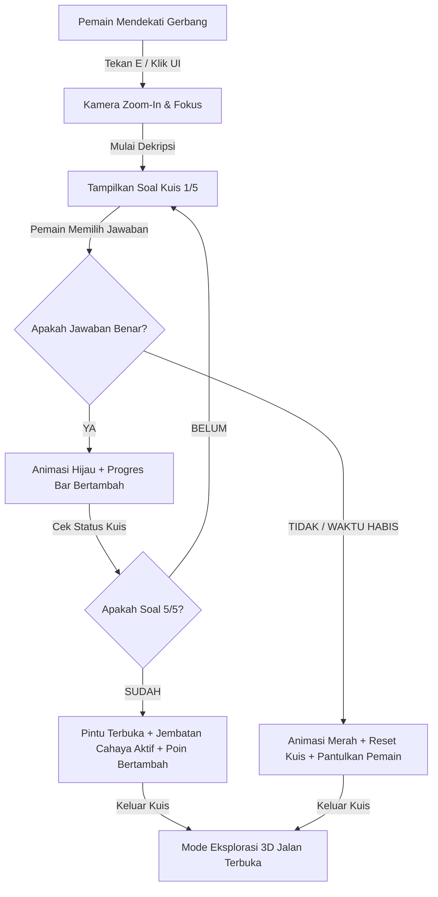

# LOG PEMBARUAN APLIKASI - QuranVerse: Odyssey 30
**Tanggal Pembaruan Terakhir**: 2026-06-25  
**Developer**: Antigravity (AI Coding Assistant)  
**Tingkat Proyek**: Ekspansi Penuh 30 Gerbang & Visual Siber Premium

Dokumen ini mencatat seluruh proses pembaruan, perbaikan bug, formula matematika fisika, dan peningkatan estetika yang telah diimplementasikan pada repositori game **QuranVerse: Odyssey 30** di direktori `d:\Proyek Game Edukasi\GAME ROBLOX ALQURAN`.

---

## 🛠️ Ringkasan Pembaruan Berdasarkan Berkas

### 1. `src/data/quran.js` (Database Al-Qur'an & Soal)
* **Kompilasi Otomatis**: Hasil ekstraksi langsung dari berkas terjemahan PDF resmi (`id_Tarjamah_Al_Fatihah_dan_Juz_Amma.pdf`) diselaraskan dengan teks Arab Utsmani dari API Quran resmi.
* **Pembersihan Teks Kasar**: Menyaring semua teks Arab yang rusak, simbol aneh, unicode `\ufffd`, harakat berantakan, serta karakter sampah lainnya. Menghasilkan database kuis yang bersih dan nyaman dibaca untuk **30 surat** (Al-Fatihah dan Juz 30 lengkap).

### 2. `src/engine3d.js` (Mesin 3D, Fisika & Visual)
* **Jalur Heliks 30 Pulau**: Merombak total susunan dunia 3D menjadi jalur spiral menaik untuk 30 pulau menggunakan koordinat:
  $$X_i = \sin(i \times 0.45) \times 18$$
  $$Y_i = i \times 1.6$$
  $$Z_i = -i \times 42$$
* **Fisika Jembatan Miring (Inclined Plane)**: Memperbaiki bug di mana pemain jatuh saat menyeberangi jembatan miring. Posisi berdiri pemain di atas jembatan tanjakan dihitung secara presisi menggunakan proyeksi vektor 3D:
  $$\text{bridgeSurfaceY} = \text{bridge.center.y} + \text{localZ} \times \text{bridge.direction.y}$$
* **Jembatan & Pulau Selaras**: Memperbaiki tinggi ujung akhir jembatan (`endPos`) agar sejajar dengan bibir atas permukaan berdiri pulau berikutnya.
* **Kredit Melengkung Gerbang**: Menambahkan tulisan kredit *"Fakhira dan Faiza Creative Design"* di atas setiap gerbang. Teks ini melengkung mengikuti busur torus gerbang dengan rotasi kemiringan masing-masing karakter secara otomatis ($rotation.z = angle - \pi/2$).
* **82 Balon Udara Meluncur & Orbit**:
  - Menambahkan 50 balon tambahan sehingga total menjadi **82 balon udara siber**.
  - Balon di-spawn di radius luar yang jauh, lalu secara dinamis meluncur mendekat (`THREE.MathUtils.lerp`) ke pulau terdekat dan mengorbit pulau tersebut dengan gerakan sinusoidal.
* **Kembang Api Siber Premium**:
  - Kembang api meletus secara berkala (interval cek 150ms, peluang 15%) di atas balon udara.
  - Setiap letusan menyebarkan **90 partikel besar bersinar** (ukuran `1.4` dengan canvas radial gradient texture agar bulat menyala indah, tidak kotak-kotak).
  - Dilengkapi **PointLight dinamis berwarna** di pusat letusan kembang api yang menerangi pulau-pulau sekitarnya secara nyata dan meredup perlahan seiring memudarnya partikel.
* **Render Loop Partikel VSync**: Semua update partikel dipindahkan ke dalam loop animasi utama (`requestAnimationFrame`) untuk menghilangkan stuttering/lag visual.

### 3. `src/game.js` (Logika Gameplay & Sesi)
* **Siklus Dekripsi 5 Soal**: Pemain harus menjawab 5 soal acak berturut-turut dengan benar untuk membuka gerbang.
* **Efek Kegagalan Instan**: Jika menjawab salah satu soal dengan salah, kuis langsung direset dan pemain dipantulkan (didorong) mundur sejauh 8 meter dari sensor gerbang.
* **Optimasi Kecepatan Diamond (Shard)**: Menghapus notifikasi popup pop-up DOM yang menghambat performa rendering visual saat diamond diambil agar permainan terasa lembut dan lancar tanpa jeda.

### 4. `src/ui.js` (Antarmuka Pengguna & Kuis)
* **Indikator Progres**: Menambahkan teks status ("SOAL 1 DARI 5") beserta bar progres visual warna hijau emerald yang terisi secara halus.
* **Penyorot Soal Negasi**: Menggunakan fungsi regex parser untuk otomatis menyorot kata negasi (seperti **BUKAN** atau **SALAH**) dengan warna merah neon agar langsung terlihat oleh pemain.

### 5. `src/controls.js` (Kontrol Pemain)
* **Penyempurnaan Tombol E**: Menambahkan pendeteksian tombol `'E'` case-insensitive (`e.key.toLowerCase() === 'e'`) beserta fallback keycode (`e.keyCode === 69`) untuk kompatibilitas penuh keyboard pada berbagai peramban.

### 6. `index.html` & `style.css` (Dokumen Utama & Styling)
* **Kredit Menu Utama**: Menambahkan teks *"Fakhira dan Faiza Creative Design"* tepat di bawah judul "QuranVerse" di halaman depan.
* **Efek Neon CSS**: Menyematkan animasi pulsing neon pada teks kredit agar terlihat menyatu dengan nuansa fiksi ilmiah siber.

---

## 🎮 Alur Mekanik Dekripsi Gerbang



---

## 🚀 Cara Menjalankan & Menguji Aplikasi Secara Lokal

1. **Jalankan Server Lokal**:
   Gunakan perintah Python di dalam direktori proyek:
   ```bash
   python -m http.server 8000
   ```
2. **Akses Game**:
   Buka peramban internet (Google Chrome/Edge/Firefox) di alamat:
   `http://localhost:8000`
3. **Uji Fungsionalitas**:
   - Berjalanlah menggunakan keyboard `W, A, S, D` atau joystick virtual (pada layar sentuh).
   - Dekati Gerbang 1 (Al-Fatihah), lalu tekan tombol **E** atau klik tombol interaksi.
   - Selesaikan 5 pertanyaan berturut-turut untuk melihat jembatan cahaya menyala dan gerbang berubah warna dari emas menjadi hijau emerald.
   - Perhatikan 82 balon udara yang melayang mendekati pulau-pulau dan menyemburkan kembang api siber neon warna-warni yang bersinar terang dan menerangi struktur pulau di sekitarnya.
